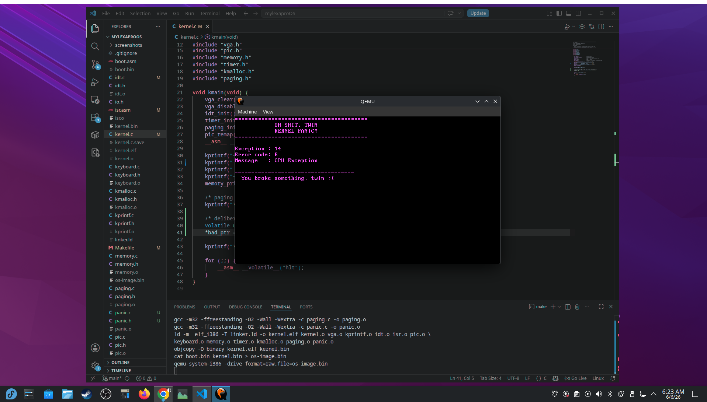

# mylexaproOS

mylexaproOS is a small 32‑bit x86 operating system built entirely from scratch.  
There is no underlying OS, no standard library, and no runtime support.  
The system boots from a custom 512‑byte boot sector, switches the CPU into protected mode, and executes a freestanding C kernel at physical address 0x8000.

This project exists to understand how computers actually work at the hardware and architectural level.

---

## Current Version: v1.9.0 — Kernel Panic Handler
 
The operating system now includes:

- Kernel panic handler with exception number, error code, and message display 
- Custom 512-byte boot sector with BIOS disk loading and E820 memory detection
- GDT setup and full 16-bit → 32-bit protected mode transition
- Freestanding C kernel loaded at 0x8000 with no libc or runtime support
- VGA text-mode driver with cursor tracking, backspace, and position control
- kprintf() supporting %d, %x, %s, %c, and %%
- IDT with ISR stubs for CPU exceptions and hardware IRQs
- PIC remapped, IRQ0 (timer) and IRQ1 (keyboard) both active
- PS/2 keyboard driver with shift, enter, backspace, and symbol support
- PIT timer driver with uptime counter displayed in top right corner
- E820 memory map displayed at boot showing base, length, and type
- First-fit physical memory allocator (kmalloc/kfree) with coalescing
- **32-bit x86 paging enabled with identity-mapped kernel (first 4MB)**
- **Page directory and page table built in C, CR3 loaded, CR0 PG bit set**
- Proper linker segments, no RWX warnings, hardware cursor disabled
- Makefile — single `make run` command to build and launch
All components are written to be fully freestanding and do not rely on libc or BIOS once in protected mode.
 
---
 
## What I'm Learning
 
- The complete boot process from power-on to kernel execution
- How BIOS loads the first 512 bytes of a disk to 0x7C00
- Real mode, protected mode, and the CPU privilege ring system
- x86 assembly with NASM — registers, interrupts, segmentation
- How to write freestanding C with no standard library or runtime
- GDT, IDT, ISR stubs, and hardware interrupt handling
- How the PIC routes hardware IRQs to the CPU
- Direct VGA hardware access and text-mode driver design
- PS/2 keyboard protocol and scancode translation
- PIT timer programming and IRQ-driven uptime tracking
- E820 BIOS memory map detection
- Linked list data structures and first-fit memory allocation
- Binary, hexadecimal, and memory addressing
- Linker scripts, program headers, and segment permissions
- How malloc and free work at the hardware level
- How paging translates virtual addresses to physical addresses
- Building page directories and page tables from scratch in C
- Identity mapping, CR3, CR0, and the MMU
- Testing bare-metal software using QEMU
---

## Project Structure

```
boot.asm        → 512‑byte bootloader, disk loading, protected‑mode switch
kernel.c        → Kernel entry point (kmain)
vga.h/.c        → VGA text‑mode driver
kprintf.h/.c    → Minimal printf implementation
idt.h/.c        → IDT setup and descriptor configuration
isr.asm         → ISR stubs for CPU exceptions
pic.h/.c        → PIC remapping and hardware IRQ initialization
keyboard.h/.c   → Basic PS/2 keyboard driver (scancodes → ASCII)
io.h            → Port I/O helpers (inb/outb wrappers)
linker.ld       → Memory layout (boot at 0x7C00, kernel at 0x8000)
Makefile        → Build and run automation
memory.h        → E820 structures and memory map declarations
memory.c        → Memory map reader and printer
timer.h/.c      → PIT timer driver, tick counter, uptime display
kmalloc.h       → heap allocator declarations and block_header struct
kmalloc.c       → first-fit allocator, kmalloc() and kfree() implementation
paging.h        → paging declarations, flags, and function prototypes
paging.c        → page directory and page table setup, CR3 load, paging enable
panic.h         → kernel panic declarations and function prototype
panic.c         → panic screen, exception info display, CPU halt
```

---

## Roadmap
 
### Completed
- Kernel panic handler with exception number and error code display
- Boot sector, GDT, protected mode transition
- C kernel execution at 0x8000
- VGA text driver with cursor, backspace, and position control
- kprintf() with %d, %x, %s, %c formatting
- IDT initialization and ISR stubs
- PIC remapping and hardware IRQ handling
- PS/2 keyboard driver with shift, enter, backspace, symbols
- E820 memory map detection and display
- PIT timer driver with uptime counter (IRQ 0)
- Proper linker segments, no RWX warnings
- First-fit physical memory allocator (kmalloc/kfree)
- 32-bit paging enabled, kernel identity mapped, virtual memory active

### In Progress
- Hardware IRQ expansion

### Planned
- Basic shell
- Process management
- System calls
- Filesystem (read files from disk)
- Rust kernel modules

---

## Version History

- v1.9.0 — kernel panic handler, page fault caught, CPU halted with error display
- v1.8.0 — paging enabled, identity mapped kernel, virtual memory active
- v1.7.0 — first-fit memory allocator, kmalloc/kfree, heap at 1MB
- v1.6.0 — PIT timer driver, uptime counter, IRQ0 active
- v1.5.0 — E820 memory detection, proper linker segments, cursor disabled
- v1.4.1 — Keyboard improvements: shift, enter, backspace, symbols
- v1.4.0 — PIC remapping, basic keyboard driver
- v1.3.0 — IDT setup and ISR stubs
- v1.2.0 — kprintf() with %d/%x/%s/%c
- v1.1.0 — VGA driver with cursor and newlines
- v1.0.0 — C kernel boots at 0x8000
- v0.4.x — Protected mode and GDT
- v0.3.x — Direct VGA text output
- v0.2.x — BIOS printing experiments

---

## Screenshots

### v1.9.0 — Kernel Panic Handler

 
Additional screenshots are available in the `screenshots/` directory.

---

## About This Project

mylexaproOS is a long-term learning project built entirely from scratch.
Every commit is a working state.

The goal isn't to ship a production OS.
The goal is to genuinely understand how computers work at every level,
from the first instruction the BIOS executes to memory allocation algorithms.