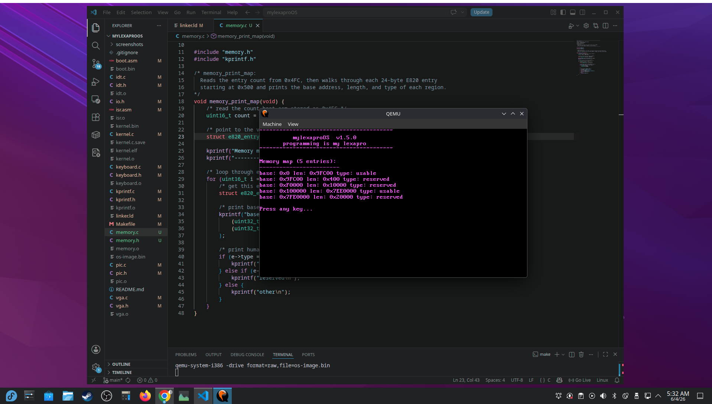

# mylexaproOS

mylexaproOS is a small 32‑bit x86 operating system built entirely from scratch.  
There is no underlying OS, no standard library, and no runtime support.  
The system boots from a custom 512‑byte boot sector, switches the CPU into protected mode, and executes a freestanding C kernel at physical address 0x8000.

This project exists to understand how computers actually work at the hardware and architectural level.

---

## Current Version: v1.5.0 — E820 Memory Map

The operating system now includes:

- A custom boot sector written in x86 assembly 
- BIOS disk loading using `int 0x13`
- A Global Descriptor Table (GDT) for protected mode
- A full 16‑bit → 32‑bit protected mode transition
- A freestanding C kernel loaded at 0x8000
- A VGA text‑mode driver with cursor tracking and newline handling
- A minimal `kprintf()` implementation supporting `%d`, `%x`, `%s`, and `%%`
- An initialized Interrupt Descriptor Table (IDT)
- Assembly ISR stubs for CPU exceptions
- PIC remapping and hardware IRQ handling
- PS/2 keyboard driver with shift, enter, backspace, and symbol support
- **E820 memory map detected in real mode before protected mode switch**
- **Memory regions displayed at boot showing base, length, and type**
- **Linker script updated with proper segment permissions (no RWX)**
- **Hardware VGA cursor disabled**
- A Makefile that builds and runs the system with `make run`

All components are written to be fully freestanding and do not rely on libc or BIOS once in protected mode.

---

## What I'm Learning

- The complete boot process from power‑on to kernel execution
- How BIOS loads the first 512 bytes of a disk to 0x7C00
- How real mode works and why x86 CPUs always start there
- How to write and assemble x86 code with NASM
- How segmentation and descriptor tables function in protected mode
- How to write C code without a standard library or runtime
- How to test bare‑metal software using QEMU

---

## Project Structure

```
boot.asm        → 512‑byte bootloader, disk loading, protected‑mode switch
kernel.c        → Kernel entry point (kmain)
vga.h/.c        → VGA text‑mode driver
kprintf.h/.c    → Minimal printf implementation
idt.h/.c        → IDT setup and descriptor configuration
isr.asm         → ISR stubs for CPU exceptions
pic.h/.c        → PIC remapping and hardware IRQ initialization
keyboard.h/.c   → Basic PS/2 keyboard driver (scancodes → ASCII)
io.h            → Port I/O helpers (inb/outb wrappers)
linker.ld       → Memory layout (boot at 0x7C00, kernel at 0x8000)
Makefile        → Build and run automation
memory.h        → E820 structures and memory map declarations
memory.c        → Memory map reader and printer
```

---

## Roadmap

### Completed
- Memory map detection (E820)
- Improved keyboard driver (Shift, enter, backspace, shift symbols)
- Boot sector and protected‑mode transition
- GDT setup
- C kernel execution at 0x8000
- VGA text driver with cursor support
- `kprintf()` with integer and hex formatting
- IDT initialization and ISR stubs
- PIC remapping
- Basic keyboard driver (letters, numbers, symbols, space)

### In Progress
- Hardware IRQ expansion
- Timer Driver (IRQ 0)

### Planned
- Physical memory allocator
- Paging and virtual memory
- Kernel panic screen
- Basic shell

---

## Version History

- v0.2.x — BIOS printing experiments
- v0.3.x — Direct VGA text output
- v0.4.x — Protected mode and GDT
- v1.0.0 — C kernel boots at 0x8000
- v1.1.0 — VGA driver with cursor and newlines
- v1.2.0 — `kprintf()` with %d/%x/%s
- v1.3.0 — IDT setup and ISR stubs
- v1.4.0 — PIC remapping + basic keyboard driver
- v1.4.1 — Shift, enter, backspace, clean build warnings fixed
- v1.5.0 — E820 memory detection, proper linker segments, cursor disabled

---

## Screenshots

### v1.5.0 — E820 Memory Map


Additional screenshots are available in the `screenshots/` directory.

---

## About This Project

mylexaproOS is a long‑term learning project.  
Every commit represents a working state that I fully understand.  
The goal is not to build a production operating system, but to gain a deep, practical understanding of how CPUs, memory, interrupts, and low‑level software actually work.